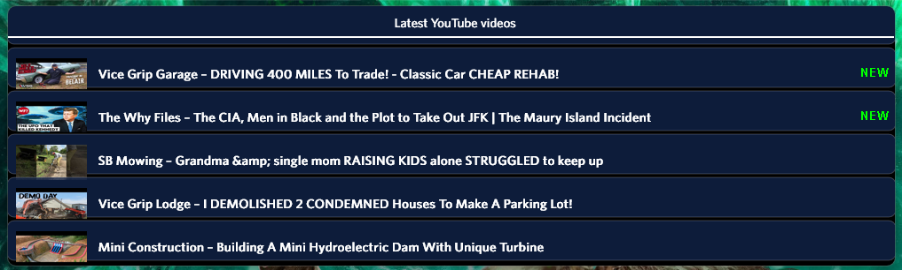

<h1 align="center">
    
  <!--a href="#"></a-->
    <picture>
  <source
    media="(prefers-color-scheme: dark)"
  />
  <source
    media="(prefers-color-scheme: light)"
  />
  
    </picture>
   
  YouTube Checker
   
</h1>

<h4 align="center">Get notified when a new video drops for up to five Youtube feeds.</h4>

  <!--a href="https://droptopfour.com/community-apps/?id=119"></a-->
  
  
  <!--img alt="Dynamic JSON Badge" src="https://img.shields.io/badge/dynamic/json?url=https%3A%2F%2Fapi.droptopfour.com%2Fv1%2Fcommunity-apps%2F119&query=%24.downloads'&label=Downloads&color=d8624c"-->

  <a href="#key-features">Key Features</a> •
  <a href="#how-to-use">How To Use</a> •
  <a href="#download">Download</a> •
  <a href="#credits">Credits</a> •
  <a href="#license">License</a>

## Key Features
• Shows latest video with a link to it for up to five feeds on YouTube.

## How to use
• Install and activate the app.  
• Right Click and go into settings.  
• Follow instructions to aquire the feed id needed to retrieve the video information.

## Download
[Droptop Four Community Apps](https://droptopfour.com/community-apps/?id=)

## Credits
Written by [TheyCallMePapa](https://github.com/papa-boynton)

## License
Creative Commons Attribution-Non-Commercial-Share Alike 3.0
